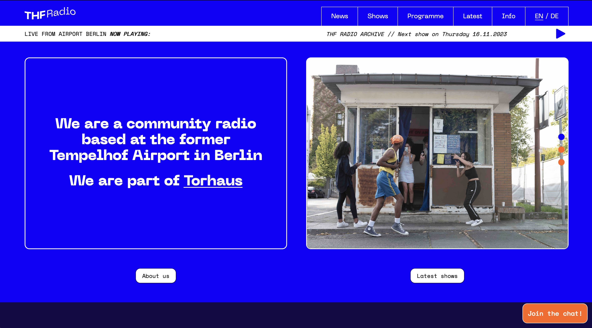
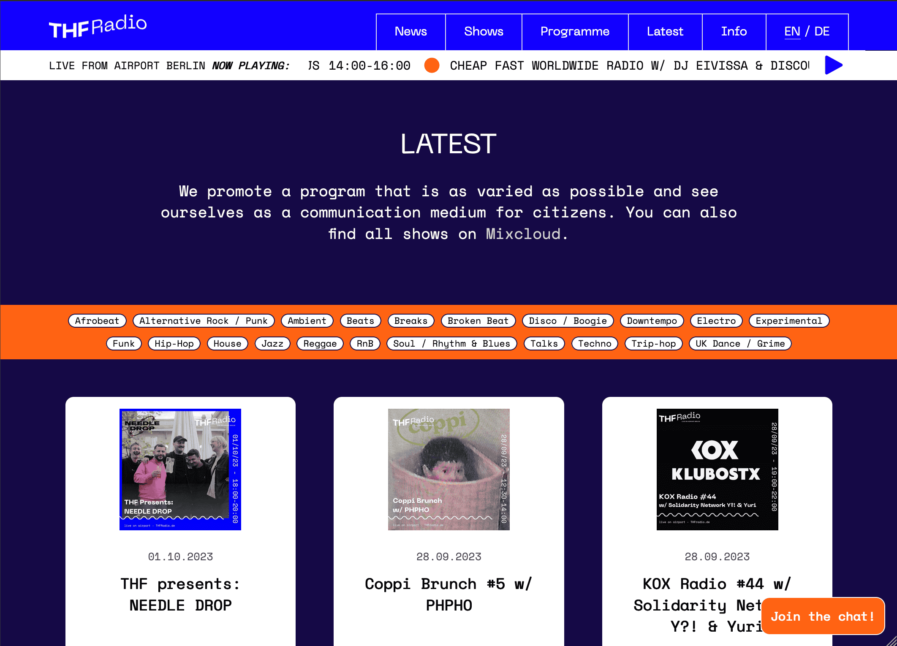
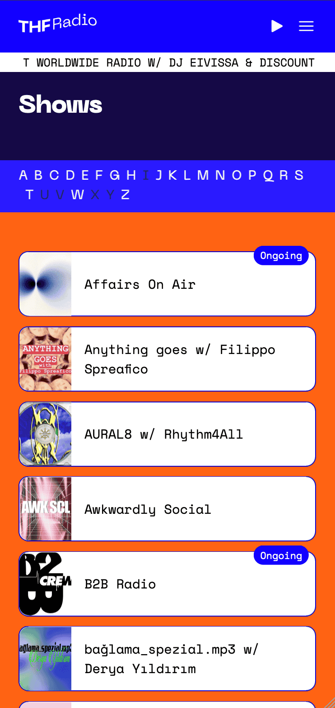

Revamping the THF Radio website is a project that holds a special place in my developper journey. First, I am musically involved with its community since its early beginnings and I have met countless interesting people through it. Second. I was literally introduced to JavaScript frameworks by the programmer who had built the first version of the site in 2020. He was kind enough to walk me through everything from npm to environment variables, data fetching, bundlers and so on, which truly helped me get started into this infinite world.

Fast forward to 2023. By then I had gained considerable experience by working on other projects and I finally found the time to dedicate myself to developing a fresh version of the site. The original site had started showing signs of strain since a little while already, maintaining it had become a challenge and hindered the implementation of new features. At the same time the radio community was growing and its members were eager to evolve on an enhanced platform.

The transition implied rewriting most of the codebase. On the frontend, we moved from Gatsby to Next.js and implemented a new design (by the talended [Eli Michiel](https://www.instagram.com/elmidesign)). On the backend, we kept our Ubuntu server to host our CMS and deployed the site through Vercel instead.

After a few months of work, we were more than happy to announce to the community that a new website was ready. 🎉

### Features

#### Live Stream and Show Archive

In continuity with the previous version of the site, the live stream remains powered by AirTime and the show archive is retrieved through the Mixcloud API. Users can effortlessly toggle between the two audio feeds, ensuring uninterrupted access to both live broadcasts and archived shows.

#### Individual Show Pages

A key addition is the introduction of dedicated pages for each radio show. Now, users can explore the details of their favorite shows more effectively. Show data is fetched from Strapi, a Node.js open-source CMS running on our server (hosted on [Uberspace](https://uberspace.de), an amazing company I definitely recommend!).

#### Bilingual Support

Recognizing our diverse audience, we prioritized offering bilingual support (English/German), breaking down language barriers.

#### Real-time Calendar Updates

Using Incremental Static Regeneration (ISR), our calendar system (using Teamup) gets real-time updates, keeping users in the loop with accurate show details.

#### Integrated Discord Chatroom

To foster community interaction, we integrated a Discord chatroom.

#### Show Filtering

Navigating content is now simpler with an intuitive show filtering feature.

### Explore THF Radio

Feel free to explore the revamped [THF Radio](https://thfradio.de/) to see the changes firsthand. For those interested in the technical side, the journey is documented on [GitHub](https://github.com/brunosj/thfradio-nextjs). THF Radio is more than a project; it's a practical effort to build a community-driven platform that resonates locally and beyond. Join us in this journey!

|  |  |
| :-----------------------------------------------------: | :---------------------------------------------------: |
