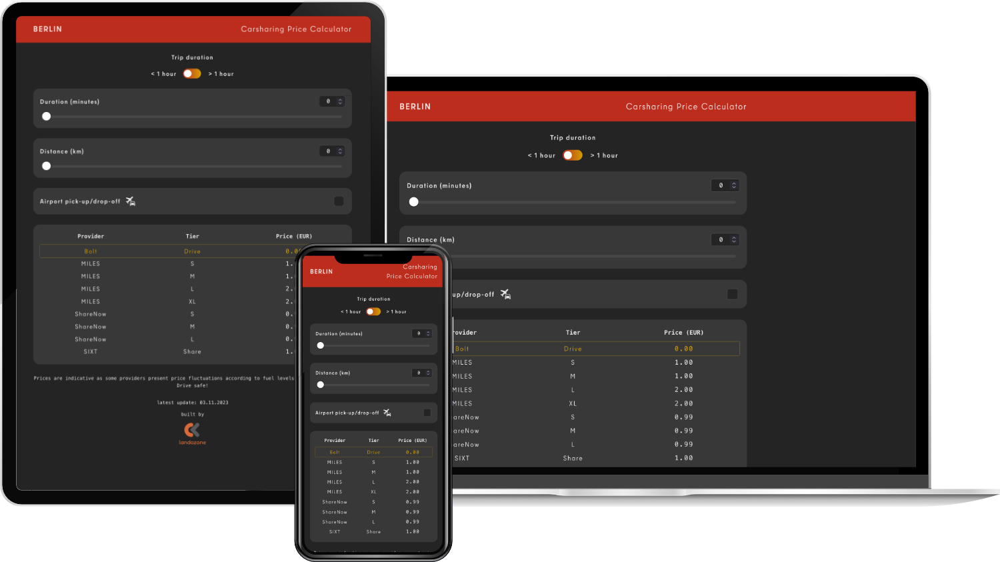

What I appreciate most about living in Berlin is that I use my bicycle for most of my commuting, which is not only environmentally-friendly but also keeps me in shape 🚴🏼‍♂️ However, when it's rainy and I need to travel a distance which would involve too many transfers with public transport I sometimes opt to use one of the different car sharing options available in the city.

Last fall was pretty rainy, and one day while I was figuring out which company to pick I had the following idea - why not build a simple app/website which would compare the prices of different providers? Since they all have different pricing models - per minute, per kilometer, with different unlocking and airport fees - this could make it easier to decide on a provider.

A few hundreds of lines of code later, the [Berlin Carsharing Price Calculator](https://carsharing.landozone.net) was born! It is a simple price calculator based on user input - one only needs to add the distance and estimated duration of a trip to get the different prices and find out which provider is the cheapest. It includes price data from MILES, ShareNow, Bolt and SIXT. You can toggle between short trips (under an hour) and long trips (more than an hour). There's also an option to add Airport Pick-Up/Drop-Off.

### Further development

#### Geolocation

An exciting update would be to add geolocation functionality to the calculator. This would allow users to add a destination and automatically input the distance and estimated duration (maybe even taking actual traffic data into account!). This could turn the app into a real "one-stop-shop" to calculate the prices, rather than having to rely on another app to estimate distance and duration.

Update 27.12.2023 - it's now implemented! 🚀

#### Real-time price updates

Price data currently need to be manually added to the codebase, as the different providers do not offer any public APIs from where to retrieve the different pricing options. A second exciting feature would be to program some sort of web crawler to retrieve the pricing information and have the frontend fetch this information to display the latest price data.
