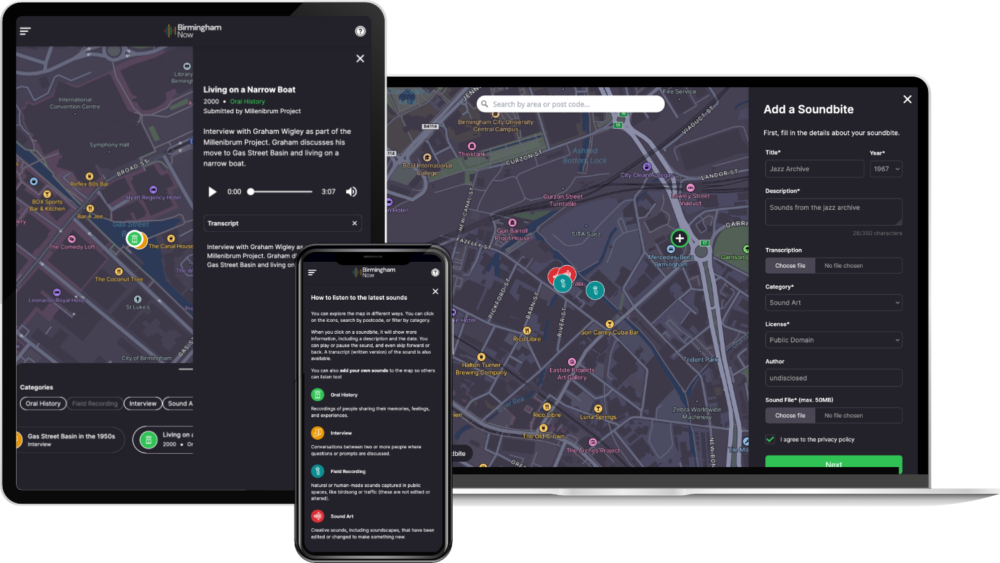

I recently had the pleasure of working on [Birmingham Now](https://brumnow.birminghammuseums.org.uk/), an interactive sound map that brings Birmingham's past and present to life through audio. Working with the team at Birmingham Museums and the folks at Devision, we created a digital space where anyone can explore and contribute to the city's sonic history.

The project combines Next.js with Payload CMS and Mapbox GL to create an immersive experience where users can both listen to existing stories and add their own soundbites to the growing collection.

