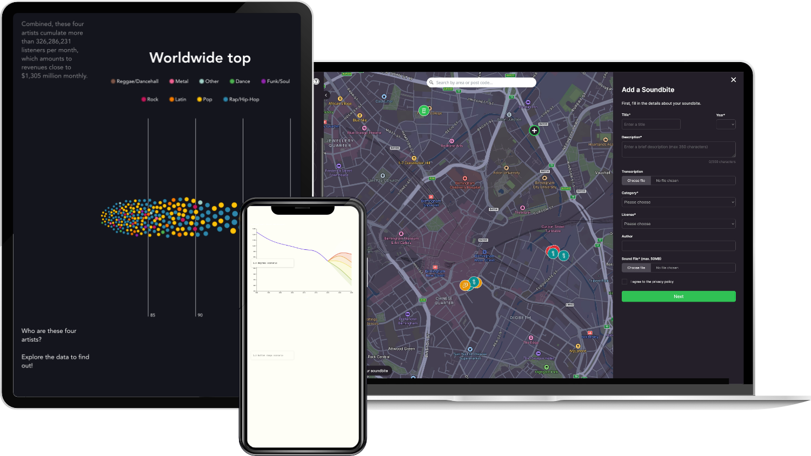

My journey into coding actually started with data visualization, back in my university days learning R and spending countless hours trying to make plots look pretty and meaningful. While I've since ventured into web development, I am always eager to experiment with data visualization techniques and libraries and always on the lookout for more opportunities to do so. Got an interesting dataviz project in mind? [Let's chat](/#contact)!

### Birmingham Now

I recently had the pleasure of working on [Birmingham Now](https://brumnow.birminghammuseums.org.uk/), an interactive sound map that brings Birmingham's past and present to life through audio. Working with the team at Birmingham Museums and the folks at Devision, we created a digital space where anyone can explore and contribute to the city's sonic history.

The project combines Next.js with Payload CMS and Mapbox GL to create an immersive experience where users can both listen to existing stories and add their own soundbites to the growing collection.

Technologies:

- Next.js (React)
- Payload CMS
- Mapbox GL JS

 

### SISTA

Early 2024 brought an exciting opportunity to work with Le Basic on [SISTA](https://lebasic.com/productions/nos-outils#Sista), a tool that helps local authorities understand their food ecosystem. We transformed complex data about agricultural production, food processing, and consumption into clear insights through interactive visualizations.

My role involved migrating the platform from Power-BI to Vue 3, creating reusable visualization components, and setting up a Storybook library to ensure consistent design across the platform.

Technologies:

- Vue 3
- E-Charts
- Storybook

 

### Experiments with D3.js

Svelte caught my attention because it was born from the need to create better interactive content, especially data visualizations. While I mostly use SvelteKit for building websites these days, I love tinkering with D3.js in my spare time. Most of my experiments are still works in progress, but I'm particularly proud of this <ExternalLink href="https://mgd.landozone.net/">interactive exploration of the Music Genre Dataset</ExternalLink>.

Technologies:

- Svelte
- D3.js

 

### Discourse Network Analysis with R

Back in 2019, I combined my interests in policy and data visualization in my master thesis, analyzing EU copyright policy through Discourse Network Analysis. Using R and the igraph package, I mapped out the complex relationships between stakeholders and their positions in the copyright debate. You can check out the methodology and findings in this <ExternalLink href="https://www.dropbox.com/scl/fi/xm1hgfjvmtk6xcijsg79l/STJACQUES-BRUNO_MT-poster_bg_web.pdf?rlkey=odz4r3ecdnt8vlcxc9icsct12&dl=0">poster</ExternalLink>.

Technologies:

- R
- Discourse Network Analyzer
- igraph

 

I was thrilled to share this work at satRday Berlin 2019, where I presented the methodology and findings. You can find my presentation slides <ExternalLink href="https://www.dropbox.com/scl/fi/vkrsbx3chenzis5anmlr6/satRday2019_St-Jacques_DNA.pdf?rlkey=hy4f7wkmqu8wcprap2yhwd5c3&dl=0">here</ExternalLink>.

 

