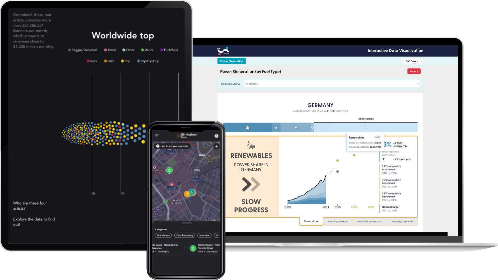
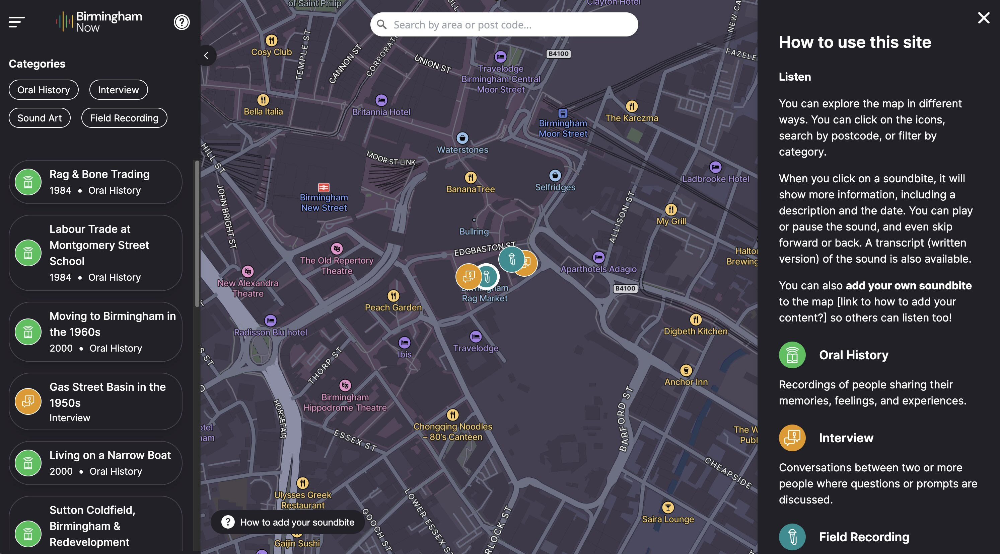
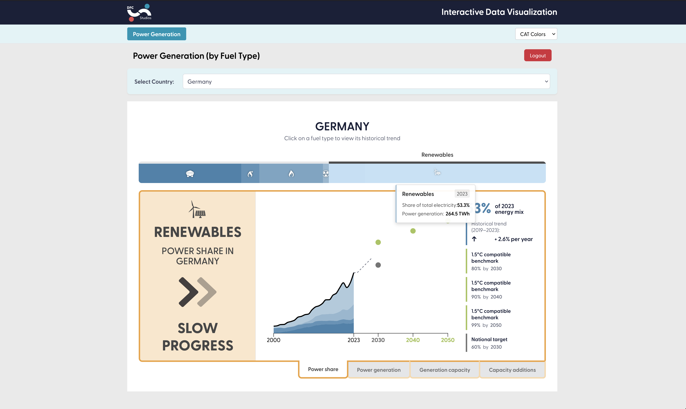
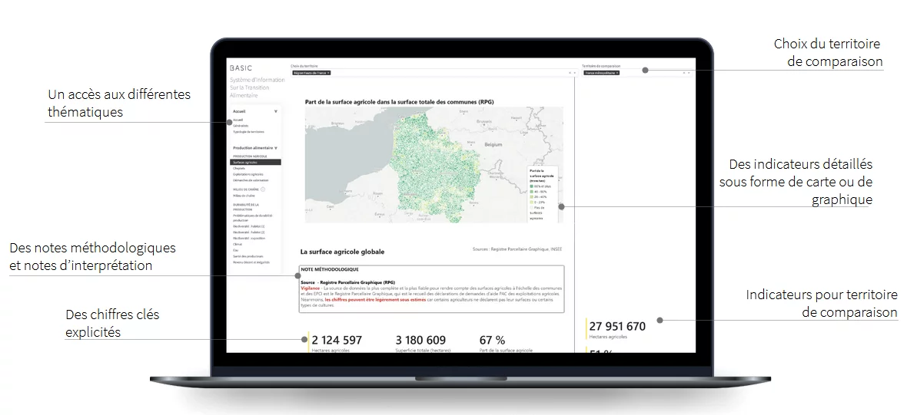
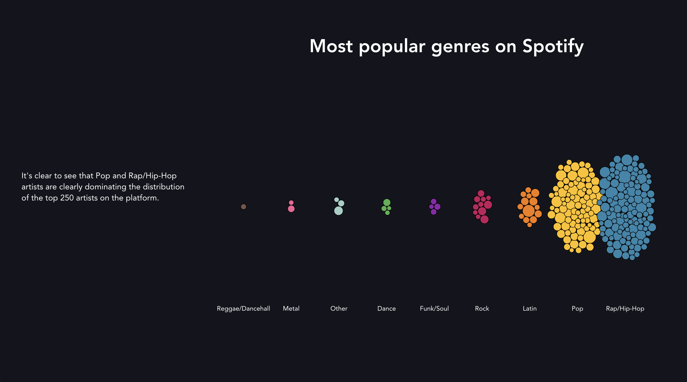
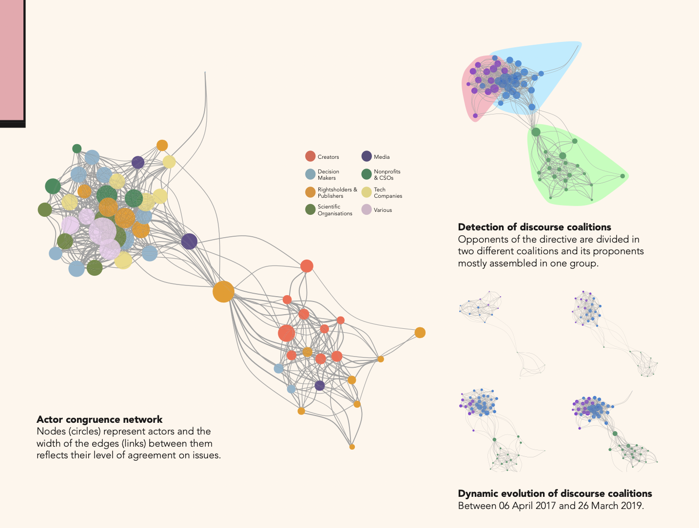
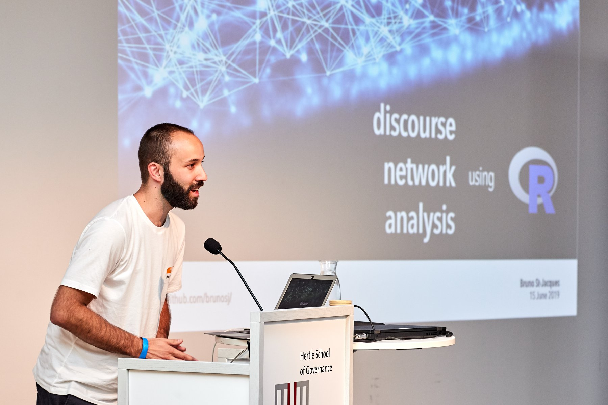

Mein Weg ins Coden begann eigentlich mit Datenvisualisierung: damals an der Uni mit R und vielen Stunden, in denen ich versucht habe, Diagramme zugleich schon und aussagekraftig zu gestalten. Auch wenn ich heute viel Webentwicklung mache, experimentiere ich weiterhin sehr gern mit Dataviz-Techniken und Libraries und halte immer Ausschau nach neuen Projekten in dem Bereich. Du hast ein spannendes Dataviz-Thema? [Lass uns sprechen](/#contact)!

### Birmingham Now

2025 durfte ich an [Birmingham Now](https://brumnow.birminghammuseums.org.uk/) mitarbeiten - einer interaktiven Soundkarte, die Birminghams Vergangenheit und Gegenwart uber Audio erlebbar macht. Zusammen mit dem Team der Birmingham Museums und Devision entstand ein digitaler Raum, in dem Menschen die klangliche Geschichte der Stadt entdecken und selbst beitragen konnen.

Das Projekt kombiniert Next.js, Payload CMS und Mapbox GL zu einem immersiven Erlebnis, in dem Nutzerinnen und Nutzer bestehende Geschichten horen und eigene Sound-Snippets zur Sammlung hinzufugen konnen.

Technologien:

- Next.js (React)
- Payload CMS
- Mapbox GL JS

 

### DFC Studios Dataviz Lab

Gemeinsam mit [DFC Studios](https://dfc.studio/) entwickeln wir interaktive Dashboard-Losungen fur Organisationen aus dem Bereich Klima-Advocacy (u. a. Climate Action Tracker, Steelwatch). Auf Basis moderner Informationsdesign- und Visualisierungsmethoden entstehen so visuell starke und gleichzeitig inhaltlich belastbare Darstellungen, die die Arbeit dieser Organisationen unterstutzen.

Technologien:

- Svelte
- D3.js

 

### SISTA

Anfang 2024 ergab sich eine spannende Zusammenarbeit mit Le Basic an [SISTA](https://lebasic.com/productions/nos-outils#Sista), einem Tool, das Kommunen hilft, ihr lokales Ernahrungssystem besser zu verstehen. Wir haben komplexe Daten zu Landwirtschaft, Verarbeitung und Konsum in klar lesbare, interaktive Visualisierungen ubersetzt.

Meine Rolle umfasste die Migration der Plattform von Power BI zu Vue 3, die Entwicklung wiederverwendbarer Visualisierungskomponenten und den Aufbau einer Storybook-Bibliothek fur konsistentes Design.

Technologien:

- Vue 3
- E-Charts
- Storybook

 

### Experimente mit D3.js

Svelte hat mich unter anderem deshalb sofort interessiert, weil es aus dem Wunsch entstanden ist, bessere interaktive Inhalte zu bauen - besonders Datenvisualisierungen. Auch wenn ich heute haufig SvelteKit fur Websites nutze, experimentiere ich in meiner Freizeit weiterhin gern mit D3.js. Vieles davon ist noch Work in Progress, aber auf diese <ExternalLink href="https://mgd.landozone.net/">interaktive Exploration des Music Genre Dataset</ExternalLink> bin ich besonders stolz.

Technologien:

- Svelte
- D3.js

 

### Discourse Network Analysis mit R

2019 habe ich in meiner Masterarbeit meine Interessen fur Policy und Datenvisualisierung verbunden und die EU-Urheberrechtspolitik mit Discourse Network Analysis untersucht. Mit R und dem igraph-Paket habe ich die Beziehungen zwischen Akteuren und ihren Positionen in der Debatte sichtbar gemacht. Methodik und Ergebnisse sind in diesem <ExternalLink href="https://www.dropbox.com/scl/fi/xm1hgfjvmtk6xcijsg79l/STJACQUES-BRUNO_MT-poster_bg_web.pdf?rlkey=odz4r3ecdnt8vlcxc9icsct12&dl=0">Poster</ExternalLink> dokumentiert.

Technologien:

- R
- Discourse Network Analyzer
- igraph

 

Ich durfte diese Arbeit bei satRday Berlin 2019 vorstellen und dort Methodik und Ergebnisse teilen. Die Slides gibt es <ExternalLink href="https://www.dropbox.com/scl/fi/vkrsbx3chenzis5anmlr6/satRday2019_St-Jacques_DNA.pdf?rlkey=hy4f7wkmqu8wcprap2yhwd5c3&dl=0">hier</ExternalLink>.

 

