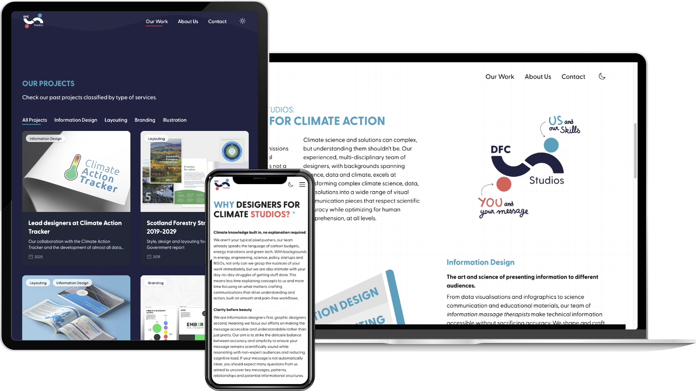
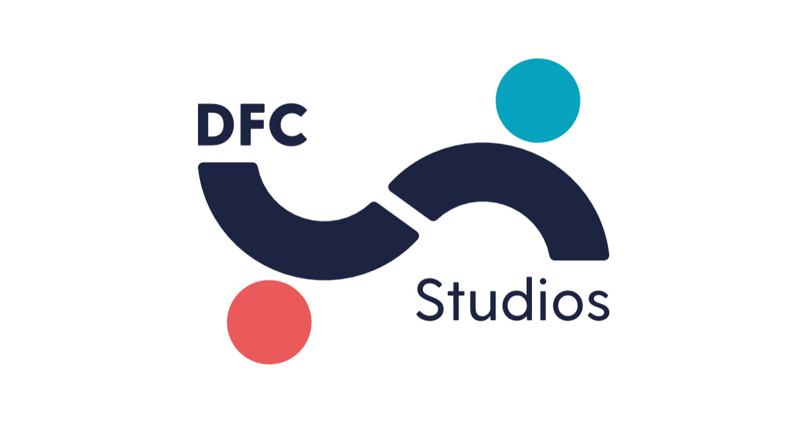

[DFC Studios](https://dfc.studio/) ist die digitale Buhne von Designers For Climate - einem gemeinnutzigen Kollektiv, das Klimahandeln durch Storytelling vorantreibt. Die Website ist visuell markant und gleichzeitig sehr funktional umgesetzt. Sie spiegelt die Bandbreite der kreativen Arbeit von DFC wider: von Informationsdesign und Layout uber Illustration und Branding bis zur Webentwicklung.

Gestalterisch greift die Seite die kraftige Farbwelt und den charakteristischen Illustrationsstil von DFC auf und verleiht jeder Sektion eine frische, dynamische Energie. Im Backend wird der gesamte Inhalt uber Payload gepflegt - ein modernes, selbst gehostetes CMS, das Content-Teams eine massgeschneiderte und intuitive Arbeitsumgebung bietet. So kann DFC seine Inhalte klar, flexibel und mit grosser gestalterischer Freiheit veroffentlichen.

