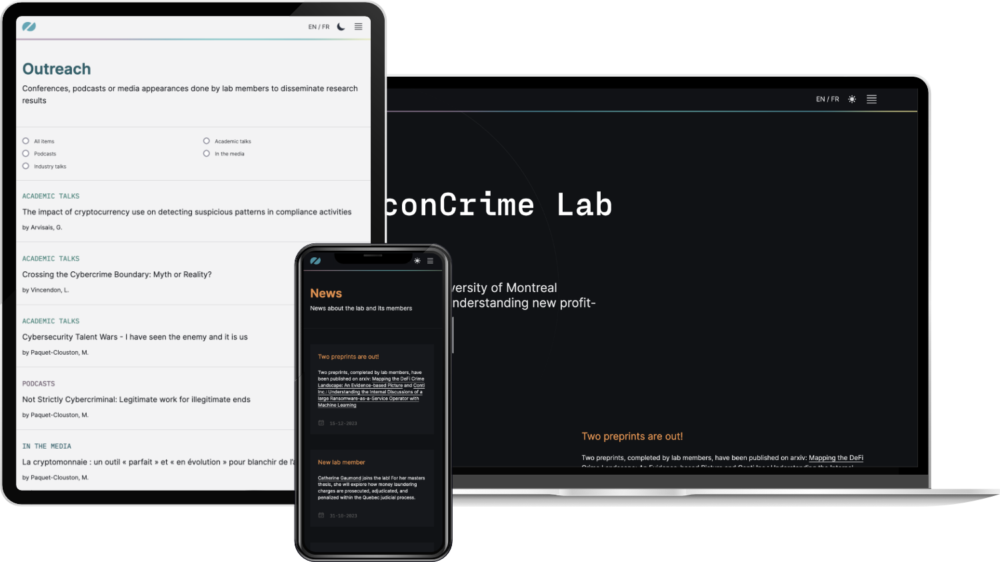

Für das [EconCrime Lab](https://econcrimelab.com/), einen Forschungsverbund an der Université de Montréal, der neue, durch Informationstechnologien ermöglichte profitorientierte Kriminalitätsformen aufdeckt und untersucht, haben wir die Website entwickelt. Sie stellt Forschung, Publikationen, Lehrangebote, Daten und Tools, Öffentlichkeitsarbeit und Neuigkeiten des Labors vor – auf Englisch und Französisch.

Die Seite basiert auf Next.js und Tailwind CSS, die Inhalte werden in Strapi gepflegt, und es gibt einen hellen und einen dunklen Modus. Die neuesten Artikel der Forschenden werden automatisch aus Google Scholar abgerufen, sodass die Publikationsliste ohne manuelle Pflege aktuell bleibt.
