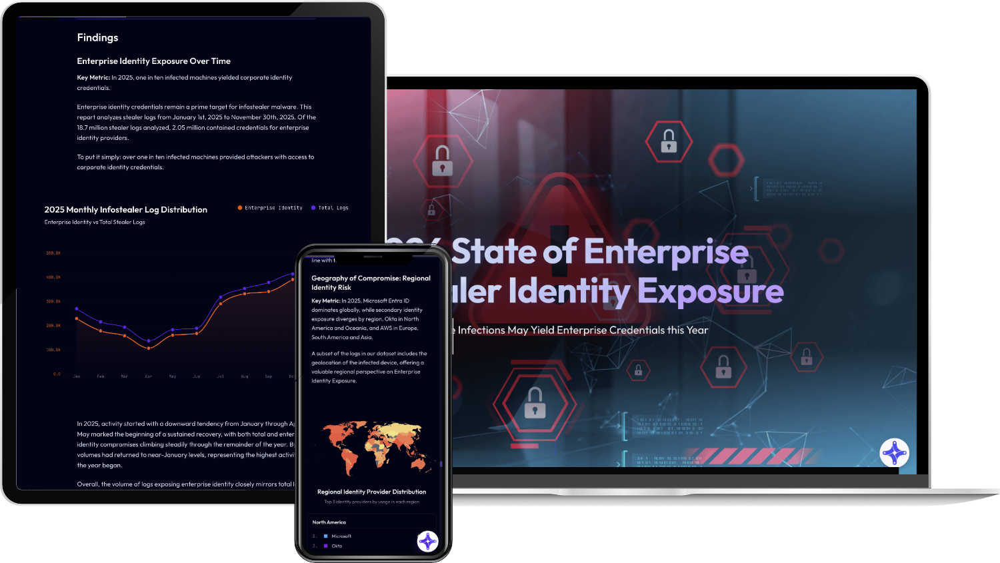
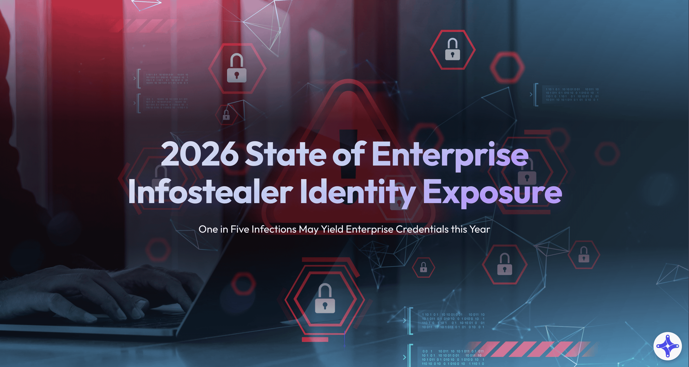

Gemeinsam mit Flare, einem Cybersicherheitsunternehmen mit Sitz in Montreal, haben wir die Inhalte ihres Berichts „[2026 State of Enterprise Infostealer Identity Exposure](https://flare.io/learn/resources/2026-enterprise-infostealer-identity-exposure)“ in eine digitale Erzählung übertragen.

Mit Scrollytelling und Datenvisualisierung sollte aus einem statischen Bericht ein interaktives, eindringliches Erlebnis werden.

