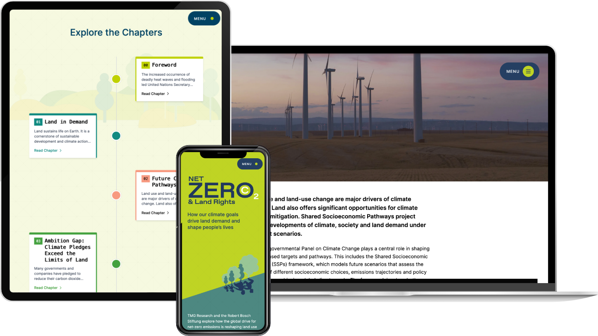

In Zusammenarbeit mit TMG Research und der Robert Bosch Stiftung habe ich [Net Zero & Land Rights](https://netzerolandrights.com/) konzipiert und entwickelt - die begleitende Website zum gemeinsamen Bericht. Der Report vereint Perspektiven aus Wissenschaft, Zivilgesellschaft sowie Stimmen aus Europa und dem Globalen Suden und analysiert kritisch, wie globale Klimastrategien mit Landrechten, Biodiversitat und sozialer Gerechtigkeit zusammenhangen.

Die Website prasentiert jedes Kapitel in einer visuell stimmigen, gut erfassbaren Form und wird durch die Illustrationen von STOCKMAR+WALTER stark aufgewertet. Jede Sektion ist so gestaltet, dass Zahlen, Grafiken und Inhalte klar und hochwertig vermittelt werden. Auf einer eigenen Ressourcenseite lassen sich samtliche Abbildungen in PNG und SVG herunterladen, erganzt durch Materialien wie Videos und Publikationen. Ausserdem gibt es einen Media-Bereich, in dem die Organisationen Kommentare und Blogbeitrage veroffentlichen konnen - so bleibt die Plattform langfristig lebendig.

