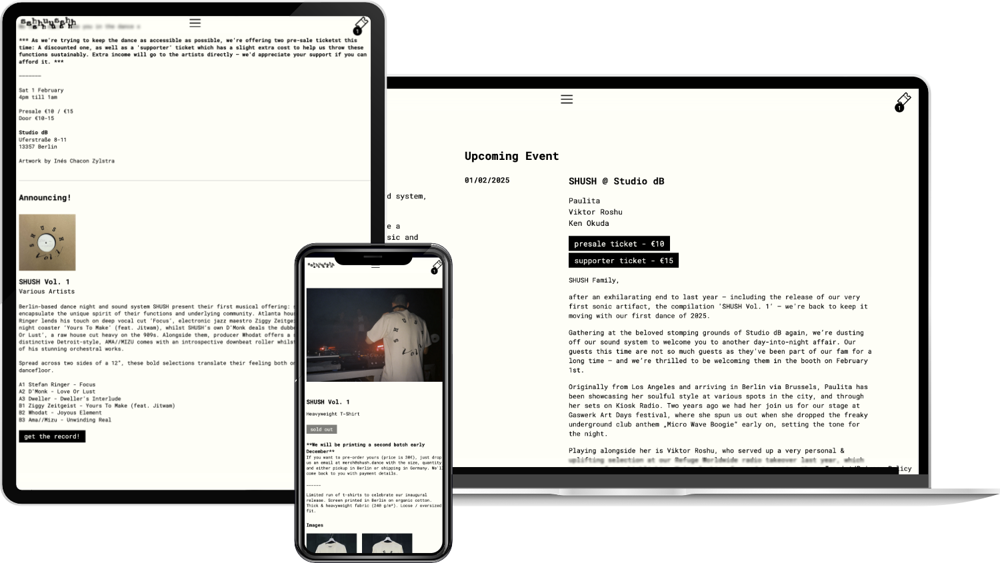

Für [SHUSH](https://shush.dance), ein Berliner Soundsystem, Musik-Kollektiv und Label, haben wir die Website entwickelt. Sie ist das digitale Zuhause der Community: Kommende Events, die Veröffentlichungen des Labels mit integriertem Audioplayer, Künstlerseiten und ein Merch-Shop sind an einem Ort vereint.

Technisch ist es eine Next.js-App mit Payload CMS auf demselben Server. Tickets, Musik und Merch werden über Stripe und PayPal bezahlt, und ein eigenes Dashboard im Admin-Bereich wertet Ticket- und Musikverkäufe pro Event und Kategorie aus, inklusive Excel-Export.
