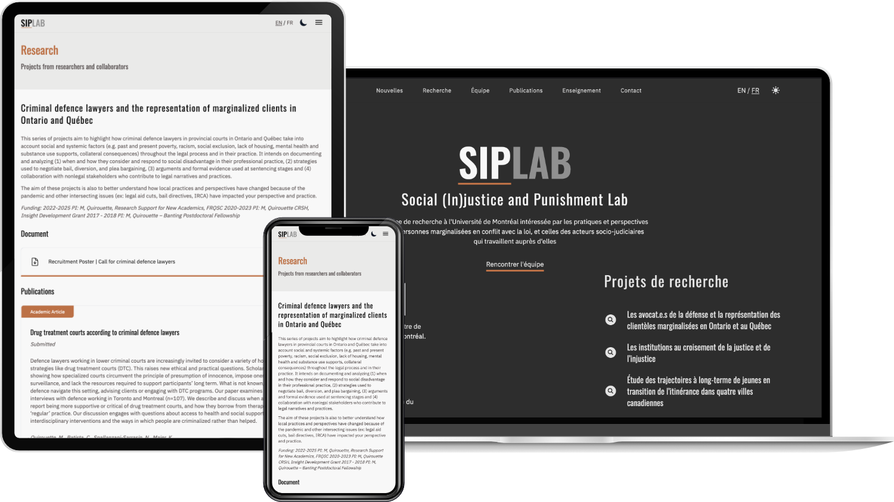

Für [SIPLAB](https://siplab.ca), einen Forschungsverbund an der Université de Montréal, haben wir die Website entwickelt. Sie gibt dem Labor einen klaren öffentlichen Auftritt und stellt Forschungsschwerpunkte, Publikationen, Lehre, Team und aktuelle Neuigkeiten vor – auf Französisch und Englisch.

Die Seite basiert auf Next.js und Tailwind CSS, die Inhalte werden in Strapi gepflegt, sodass das Team neue Publikationen und News selbst veröffentlichen kann. Zudem lässt sich zwischen hellem und dunklem Modus wechseln.
