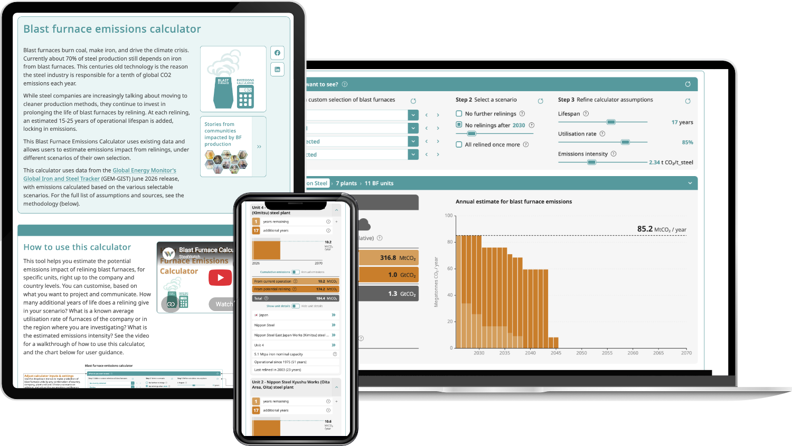

Nach der [Corporate Scorecard](/projects/steelwatch-corporate-scorecard) haben wir erneut mit [Designers for Climate Studios](https://dfc.studio) und SteelWatch zusammengearbeitet – diesmal an einem interaktiven Rechner zu einem der größten blinden Flecken der Stahlindustrie beim Klimaschutz: der Neuzustellung von Hochöfen.

Rund 70 % des weltweiten Stahls basieren noch immer auf Eisen aus kohlebefeuerten Hochöfen. Alle 15 bis 20 Jahre muss ein Hochofen neu zugestellt werden, und jede Neuzustellung verlängert seinen Betrieb um weitere 15 bis 25 Jahre – Emissionen, die damit weit über die Klimaziele hinaus festgeschrieben werden. Der Blast Furnace Emissions Calculator macht diese Entscheidung sichtbar: Auf Basis der Daten des Global Iron and Steel Tracker von Global Energy Monitor projiziert er die künftigen CO₂-Emissionen von über 1.000 aktiven Hochöfen in rund 420 Werken und 44 Ländern.

Du kannst von allen erfassten Werken auf ein Land, eine Auswahl von Unternehmen, ein einzelnes Werk oder einen einzelnen Hochofen zoomen, ein Szenario wählen (keine weiteren Neuzustellungen, keine Neuzustellungen nach einem gewählten Stichjahr oder jeder Hochofen wird noch einmal neu zugestellt) und Lebensdauer, Auslastung und Emissionsintensität feinjustieren. Ein gestapeltes Balkendiagramm trennt die Emissionen der laufenden Ofenreise von denen, die eine Neuzustellung hinzufügen würde, mit Markierungen für 50 % und 100 % Reduktion vor dem Netto-Null-Horizont 2050. Eine Wirkungsbox übersetzt die kumulierte Summe in greifbare Vergleiche, von Flügen um die Welt bis zu Jahresemissionen ganzer Länder. Unter dem Diagramm werden die Hochöfen, deren nächste Neuzustellung am nächsten liegt, als Karten oder in einer sortierbaren Tabelle aufgelistet – so sehen Journalist\*innen, Analyst\*innen und Kampagnenakteur\*innen auf einen Blick, wo die nächsten Entscheidungen fallen.

Technisch ist es eine SvelteKit-App mit einer reinen, vollständig getesteten TypeScript-Rechenlogik, D3-basierten Diagrammen, teilbaren URLs, die jedes Szenario abbilden, sowie Inhalten auf Englisch und Japanisch, die das Redaktionsteam von SteelWatch über ein Google Sheet pflegt. Dieselben Ansichten sind als WordPress-Plugin paketiert und direkt in die Website von SteelWatch eingebettet.

Den Rechner [hier](https://steelwatch.org/bf-calculator/) ausprobieren.
