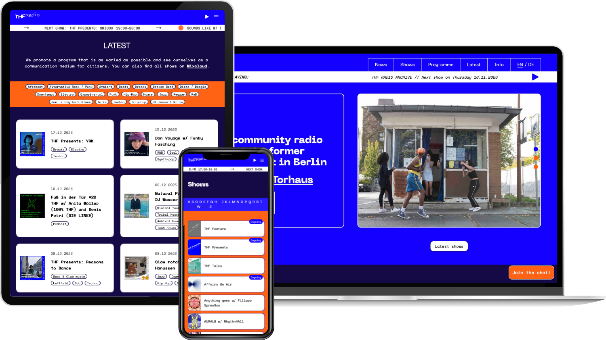

Der Relaunch der THF-Radio-Website hat fur mich einen besonderen Stellenwert. Erstens bin ich seit den fruhen Anfangen musikalisch in der Community dabei und habe uber das Projekt viele spannende Menschen kennengelernt. Zweitens hat mich genau dieses Projekt in JavaScript-Frameworks eingefuhrt: Der Entwickler der ersten Version von 2020 hat mir damals grosszugig alles von npm uber Umgebungsvariablen bis zu Datenabfragen und Bundlern erklart - ein entscheidender Einstieg in diese Welt.

Sprung ins Jahr 2023: Die ursprungliche Seite stiess technisch zunehmend an Grenzen. Wartung wurde aufwendig, neue Funktionen liessen sich nur schwer umsetzen. Gleichzeitig wuchs die Community, und der Wunsch nach einer besseren Plattform wurde lauter. Mit der Erfahrung aus anderen Projekten konnte ich mir endlich die Zeit nehmen, eine neue Version zu bauen.

Der Umstieg bedeutete, einen grossen Teil der Codebasis neu zu schreiben. Im Frontend wechselten wir von Gatsby zu Next.js und setzten ein neues Design um (von [Eli Michiel](https://www.instagram.com/elmidesign)). Im Backend blieben wir bei unserem Ubuntu-Server fur das CMS, deployten die Website jedoch uber Vercel.

Nach ein paar Monaten konnten wir der Community endlich die neue Website zeigen 🎉

### Funktionen

#### Livestream und Show-Archiv

Wie in der vorherigen Version wird der Livestream uber Airtime Pro bereitgestellt und das Archiv uber die Mixcloud-API geladen. Nutzerinnen und Nutzer konnen nahtlos zwischen beiden Audioquellen wechseln.

#### Eigene Seiten fur jede Show

Neu sind dedizierte Seiten fur einzelne Sendungen. Damit lassen sich Formate deutlich besser entdecken. Die Show-Daten kommen aus Strapi, einem Open-Source-CMS auf Node.js-Basis, das auf unserem Server lauft (gehostet bei [Uberspace](https://uberspace.de) - klare Empfehlung).

#### Zweisprachigkeit

Uns war wichtig, die Website zweisprachig (Deutsch/Englisch) anzubieten, damit mehr Menschen sie einfach nutzen konnen.

#### Kalender-Updates in Echtzeit

Dank Incremental Static Regeneration (ISR) wird der Kalender (Teamup) laufend aktualisiert, damit Sendungsinfos immer aktuell sind.

#### Integrierter Discord-Chat

Zur Starkung der Community haben wir einen Discord-Chat direkt in die Plattform integriert.

#### Show-Filter

Durch eine intuitive Filterfunktion lassen sich Inhalte schneller finden und besser durchsuchen.

### THF Radio entdecken

Schau dir die neue Version von [THF Radio](https://thfradio.de/) einfach selbst an. Wenn dich die technische Umsetzung interessiert, findest du den Projektverlauf auf [GitHub](https://github.com/brunosj/thfradio-nextjs). THF Radio ist fur mich mehr als ein Projekt - es ist ein praktischer Beitrag zu einer communitybasierten Plattform mit lokaler Verankerung und Reichweite daruber hinaus.
