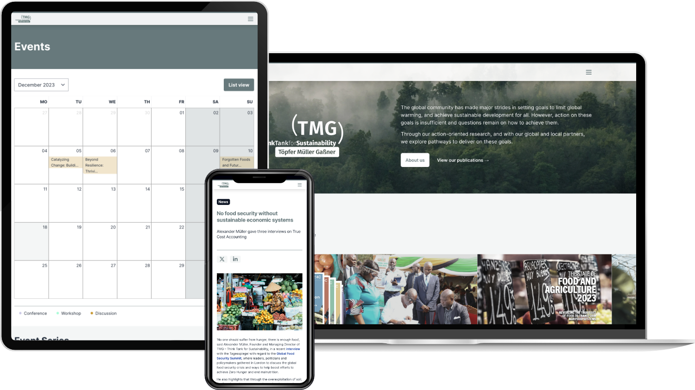

Seit 2023 arbeiten wir mit dem [TMG Think Tank for Sustainability](https://tmg-thinktank.com/) zusammen, einer gemeinnützigen Organisation und Beratung aus Berlin, die sich mit Nachhaltigkeitstransformationen beschäftigt. Die Website bündelt eine große Menge an Inhalten an einem durchsuchbaren Ort: Programme, Projekte und Initiativen, Publikationen und Berichte, Events und Veranstaltungsreihen, Videos, News, einen Blog, das Team und offene Stellen.

2026 haben wir das SvelteKit-Frontend von Contentful auf ein selbst gehostetes Payload CMS migriert. Die Redaktion kann Berichtsseiten nun direkt im CMS zusammenstellen, PDF-Vorschaubilder werden beim Hochladen automatisch erzeugt, und Publikationen sind direkt über ihre DOI-Nummer erreichbar. Volltextsuche, Kalender-Buttons für Events und eine Newsletter-Anmeldung über Brevo runden das Angebot ab, während ein Redis-gestützter Cache die Seiten schnell hält und bei jeder Veröffentlichung nur das aktualisiert, was sich geändert hat.
