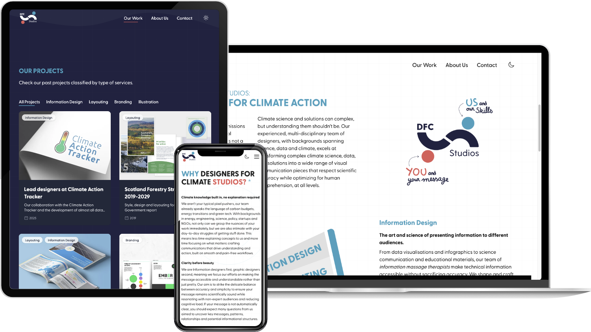
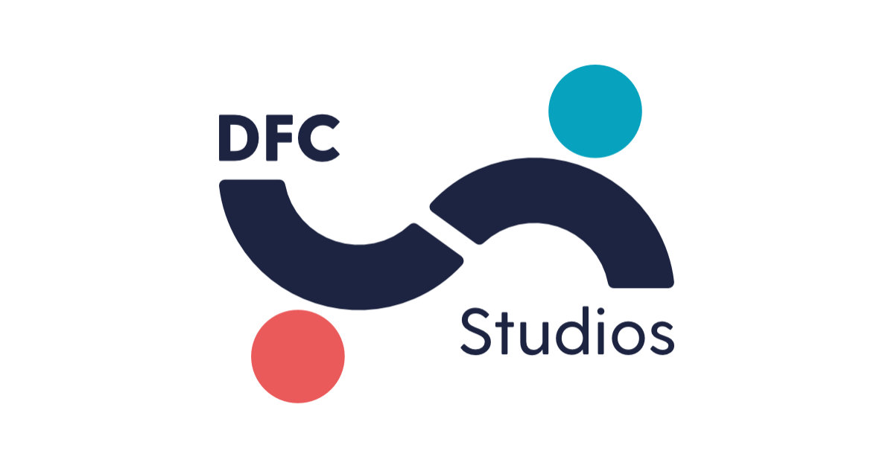

[DFC Studios](https://dfc.studio/) is the digital showcase for Designers For Climate, a non-profit collective driving climate action through the power of storytelling. The site was designed to be both visually striking and highly functional, reflecting the diverse nature of DFC's creative output—ranging from information design and layout to illustration, branding, and web development.

Visually, the website embraces DFC’s bold color palette and signature illustrations, infusing each section with a fresh, dynamic energy. On the backend, all content is managed through Payload—an innovative, self-hosted Content Management System that offers a tailored and intuitive experience for content creators, enabling DFC to share their work with clarity and creative freedom.

