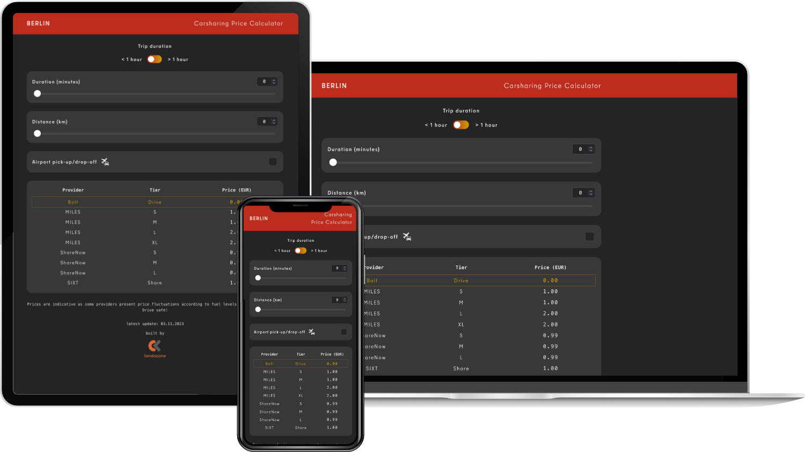

Berlin is our everyday base, and for most short trips we still reach for bicycles: low impact and good for the head 🚴🏼‍♂️ On rainy days, when public transport would mean too many transfers, we often fall back on the city's car-sharing options.

After one too many grey weeks comparing providers by hand, we sketched a simple question: what if a small site compared prices side by side? Each operator uses different rules (per minute, per kilometer, unlock fees, airport surcharges), so a single calculator could make the choice less guessy.

A few hundreds of lines of code later, the [Berlin Carsharing Price Calculator](https://carsharing.landozone.net) was born! It is a simple price calculator based on user input - one only needs to add the distance and estimated duration of a trip to get the different prices and find out which provider is the cheapest. It includes price data from MILES, ShareNow, Bolt and SIXT. You can toggle between short trips (under an hour) and long trips (more than an hour). There's also an option to add Airport Pick-Up/Drop-Off.

### Further development

#### Geolocation

An exciting update would be to add geolocation functionality to the calculator. This would allow users to add a destination and automatically input the distance and estimated duration (maybe even taking actual traffic data into account!). This could turn the app into a real "one-stop-shop" to calculate the prices, rather than having to rely on another app to estimate distance and duration.

Update 27.12.2023 - it's now implemented! 🚀

#### Real-time price updates

Price data currently need to be manually added to the codebase, as the different providers do not offer any public APIs from where to retrieve the different pricing options. A second exciting feature would be to program some sort of web crawler to retrieve the pricing information and have the frontend fetch this information to display the latest price data.
