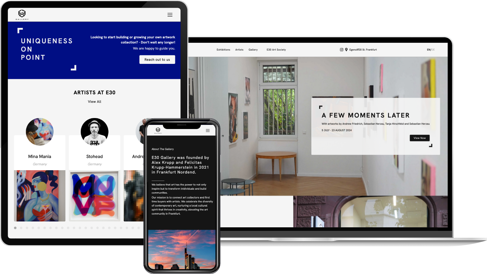

We built the website of [E30 Gallery](https://e30gallery.com/), an art gallery in Frankfurt am Main. Visitors can browse current and past exhibitions, discover the represented artists and their works, and read the gallery's insights, in both English and German.

Beyond the public site, the E30 Art Society gives members their own account and a members-only area, while newsletter sign-ups and contact forms help the gallery grow its community. The frontend is a Next.js app, the content lives in a separate Payload CMS, and both are deployed automatically to a dedicated server via GitHub Actions.
