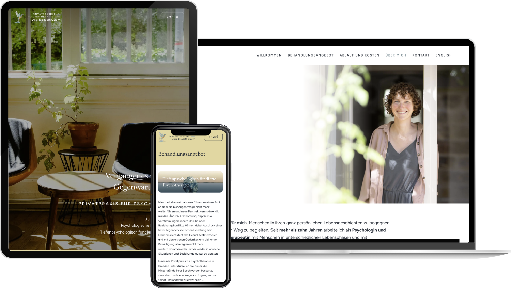

We built the website for [Julia-Elisabeth Galow](https://psychotherapie-galow.de/)'s private practice for psychodynamic psychotherapy in Dresden. The goal was a calm, warm space that feels as welcoming as the practice itself, where prospective clients can learn about her approach, her treatment offer and how therapy works, then get in touch in just a few steps.

Under the hood, the site runs on Next.js and Payload CMS, so the content in German and English can be edited directly through a modular page builder with live preview. A multi-step contact form with spam protection, client testimonials, and solid local SEO round out the project.
