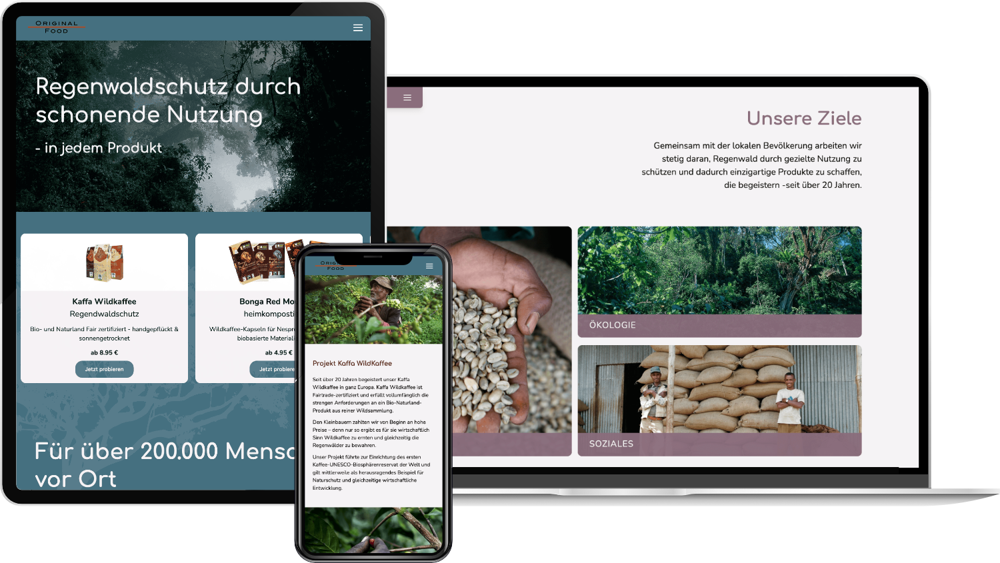

We built the website of [Original Food](https://originalfood.coffee), a company on a mission to protect rainforests, value local cultures and create real prospects for the communities it works with, including coffee growers in the Kaffa region of Ethiopia. The site presents its products, the partner projects behind them and press coverage, with an illustrated map tracing the journey back to the source.

It is built with SvelteKit, TypeScript and Tailwind CSS, with content managed in Strapi. Soft wave shapes, product and press carousels and a scrolling marquee of partner logos give it a light, organic feel that matches the brand.
