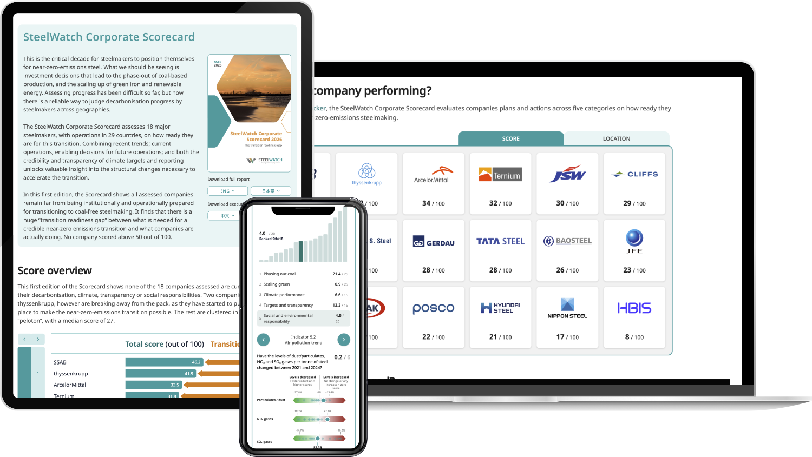

In collaboration with [Designers for Climate Studios](https://dfc.studio) and SteelWatch, we built an interactive dashboard exploring the decarbonisation performance of major steelmakers.

SteelWatch Corporate Scorecard is a public dashboard for comparing 18 major steelmakers (29 countries) on transition readiness. The main view is a company grid: each tile shows identity, rank, and a mini score snapshot, sortable by overall score or by size; in the size view, a world map ties footprint to geography.

Choosing a company opens a detail panel where you can step through producers without losing context, see how the overall result breaks down across the six methodology categories, and drill from category into sub-indicators, so a headline score is never a black box: you can see where a company earns or loses points, how it ranks peers on that slice, and read sub-indicator charts and narrative that explain the evidence behind each band. That layout is meant for analysts, journalists, and campaigners who need both a quick leaderboard and defensible depth in one session.

Technically it is a SvelteKit app with server-loaded scorecard data in Postgres (Drizzle), D3-based charts (including the grid mini charts and sub-indicator graphics), and packaging aimed at embedding the same views in WordPress alongside Steelwatch’s editorial site.

Explore the scorecard [here](https://steelwatch.org/scorecard/).

