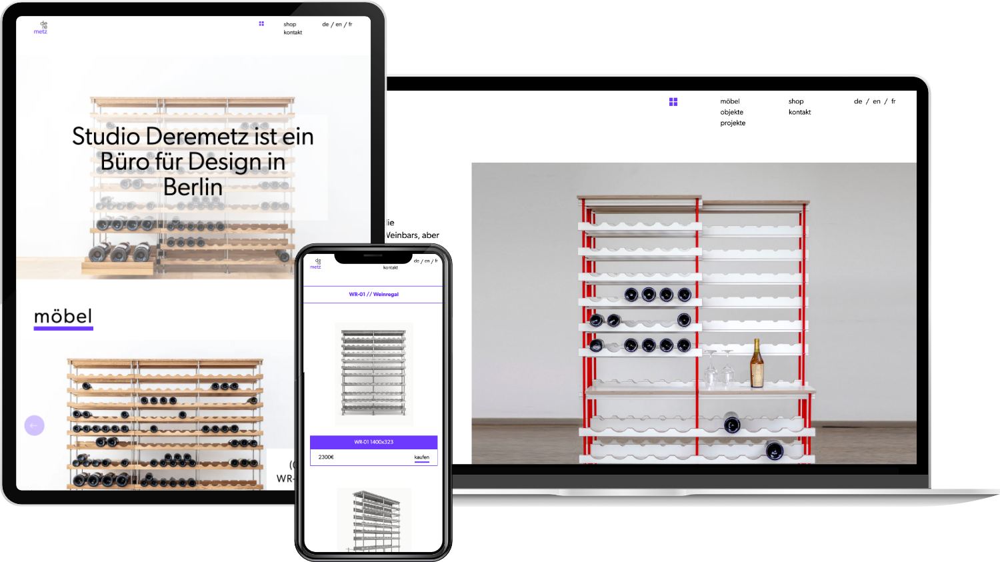

We developed the website of [Studio Deremetz](https://deremetz.de/), a Berlin-based studio for architecture and interior design. Alongside a portfolio of projects, the site showcases the studio's own furniture collections and design objects, its designers and clients, and an image gallery.

It is built with Next.js and Tailwind CSS, with content managed in Strapi and available in English, German and French. An integrated online shop lets customers order pieces directly, paying by Stripe, PayPal or invoice.
