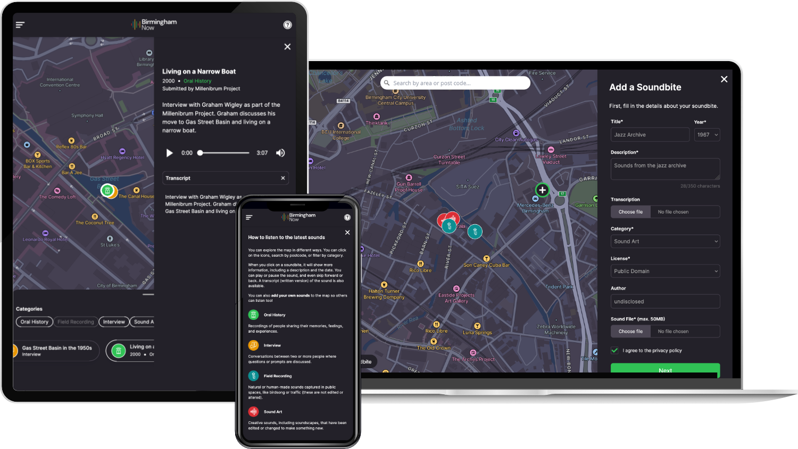

J’ai récemment travaillé sur [Birmingham Now](https://brumnow.birminghammuseums.org.uk/), une carte sonore interactive qui fait entendre le passé et le présent de Birmingham. Avec Birmingham Museums et Devision, nous avons créé un espace où chacun peut explorer et enrichir l’histoire sonore de la ville.

Le projet combine Next.js, Payload CMS et Mapbox GL pour une expérience immersive : écouter les récits existants ou ajouter ses propres extraits à la collection.

