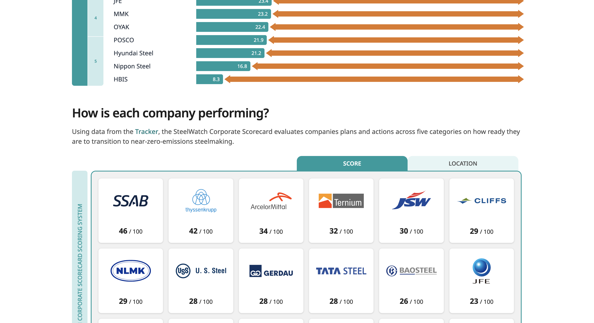

Mon parcours en code a commencé par la visualisation de données, à l’université avec R et des heures à rendre des graphiques à la fois lisibles et beaux. Depuis je me suis tourné vers le web, mais j’aime toujours expérimenter techniques et bibliothèques de dataviz et je reste à l’affût de nouvelles occasions d’en faire.

Un projet dataviz en tête ? [Écrivons-nous](/#contact) !

### SteelWatch Corporate Scorecard 2026

Avec [Designers for Climate Studios](https://dfc.studio) et SteelWatch, nous avons conçu un tableau de bord interactif sur la performance de décarbonation des grands producteurs d’acier.

[SteelWatch Corporate Scorecard](https://steelwatch.org/scorecard/) est un tableau de bord public qui compare 18 grands sidérurgistes (29 pays) sur leur préparation à la transition. La vue principale est une grille d’entreprises : chaque tuile affiche l’identité, le rang et un mini aperçu du score, avec tri par score global ou par taille ; en vue « taille », une carte du monde relie l’empreinte à la géographie.

Choisir une entreprise ouvre un panneau de détail : vous pouvez enchaîner les producteurs sans perdre le fil, voir comment le résultat global se décline dans les six catégories de la méthodologie, puis descendre des catégories vers les sous-indicateurs — le score principal n’est jamais une boîte noire : vous voyez où une entreprise gagne ou perd des points, comment elle se situe face aux pairs sur ce volet, et vous lisez graphiques et textes explicatifs sur les sous-indicateurs qui justifient chaque tranche. Cette structure s’adresse aux analystes, aux journalistes et aux responsables de campagnes qui ont besoin à la fois d’un classement rapide et d’une profondeur argumentée en une session.

Techniquement, il s’agit d’une appli SvelteKit avec des données scorecard chargées côté serveur dans Postgres (Drizzle), des graphiques basés sur D3 (y compris les mini-graphiques de la grille et ceux des sous-indicateurs), et une intégration pensée pour embarquer les mêmes vues dans WordPress aux côtés du site éditorial de SteelWatch.

Découvrir le scorecard [ici](https://steelwatch.org/scorecard/).

### Flare 2026 – rapport sur l’exposition des identités aux infostealers en entreprise

Avec Flare, une entreprise de cybersécurité basée à Montréal, j’ai transposé le contenu de leur rapport « [2026 State of Enterprise Infostealer Identity Exposure](https://flare.io/learn/resources/2026-enterprise-infostealer-identity-exposure) ». En combinant scrollytelling et visualisation de données, l’objectif était de transformer un rapport statique en une expérience interactive et convaincante.

### Birmingham Now

En 2025 j’ai travaillé sur [Birmingham Now](https://brumnow.birminghammuseums.org.uk/), une carte sonore interactive pour le passé et le présent de Birmingham. Avec Birmingham Museums et Devision, nous avons ouvert un espace où l’on explore et contribue à l’histoire sonore de la ville.

Next.js, Payload CMS et Mapbox GL permettent une expérience immersive : écouter les récits existants ou ajouter ses propres extraits à la collection.

Technologies :

- Next.js (React)
- Payload CMS
- Mapbox GL JS

 

### DFC Studios Dataviz Lab

Avec [DFC Studios](https://dfc.studio/), nous construisons des tableaux de bord interactifs pour des organisations du climat (Climate Action Tracker, SteelWatch, etc.). En nous appuyant sur un design d’information et des outils de visualisation récents, nous cherchons des vues claires et utiles au service de leur mission.

Technologies :

- Svelte
- D3.js

 

### SISTA

Début 2024 : collaboration avec Le Basic sur [SISTA](https://lebasic.com/productions/nos-outils#Sista), un outil pour aider les collectivités à comprendre leur système alimentaire. Nous avons traduit des données complexes (production, transformation, consommation) en visualisations interactives lisibles.

J’ai migré la plateforme de Power BI vers Vue 3, créé des composants de visualisation réutilisables et mis en place Storybook pour homogénéiser l’interface.

Technologies :

- Vue 3
- E-Charts
- Storybook

 

### Expérimentations avec D3.js

Svelte m’a attiré parce qu’il est né du besoin de créer de meilleurs contenus interactifs, en particulier en dataviz. Aujourd’hui je construis surtout avec SvelteKit, mais j’aime bricoler D3.js sur le temps libre. Beaucoup de tests restent en cours, mais je suis particulièrement fier de cette <ExternalLink href="https://mgd.landozone.net/">exploration interactive du Music Genre Dataset</ExternalLink>.

Technologies :

- Svelte
- D3.js

 

### Analyse de réseau discursif avec R

En 2019, mon mémoire croisait politique publique et dataviz : analyse du droit d’auteur européen par analyse de réseau discursif. Avec R et igraph, j’ai cartographié acteurs et positions. Méthode et résultats dans ce <ExternalLink href="https://www.dropbox.com/scl/fi/xm1hgfjvmtk6xcijsg79l/STJACQUES-BRUNO_MT-poster_bg_web.pdf?rlkey=odz4r3ecdnt8vlcxc9icsct12&dl=0">poster</ExternalLink>.

Technologies :

- R
- Discourse Network Analyzer
- igraph

 

J’ai présenté ce travail à satRday Berlin 2019 ; les slides sont <ExternalLink href="https://www.dropbox.com/scl/fi/vkrsbx3chenzis5anmlr6/satRday2019_St-Jacques_DNA.pdf?rlkey=hy4f7wkmqu8wcprap2yhwd5c3&dl=0">ici</ExternalLink>.

 

