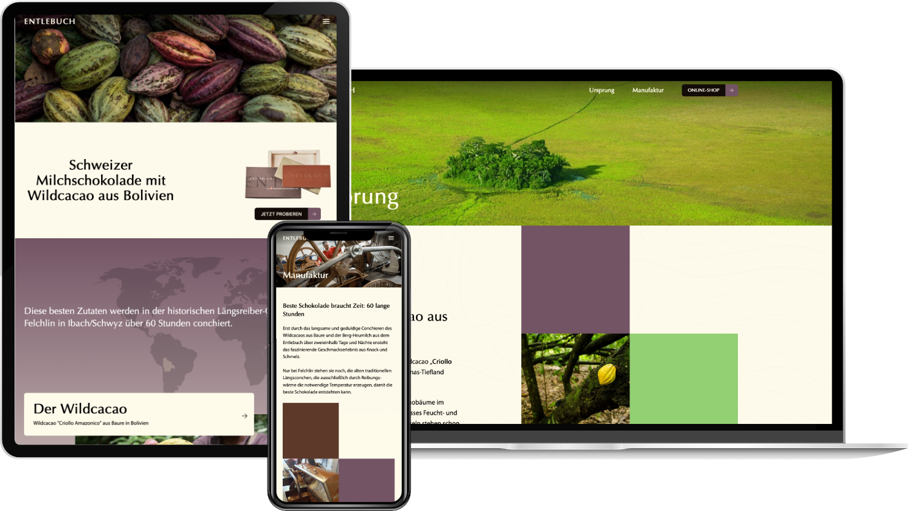

Pour [Entlebuch](https://die-beste.art), un chocolat au lait suisse élaboré avec un cacao sauvage rare de Bolivie, nous avons conçu une page de présentation qui raconte l’histoire derrière chaque tablette : l’origine du cacao, le savoir-faire de la manufacture et la mission de la marque.

Le site repose sur SvelteKit, TypeScript et Tailwind CSS, avec des contenus gérés dans Strapi. Des couleurs chaleureuses, des carrousels, des témoignages et un formulaire de contact complètent une expérience de marque aussi artisanale que le produit lui-même.
