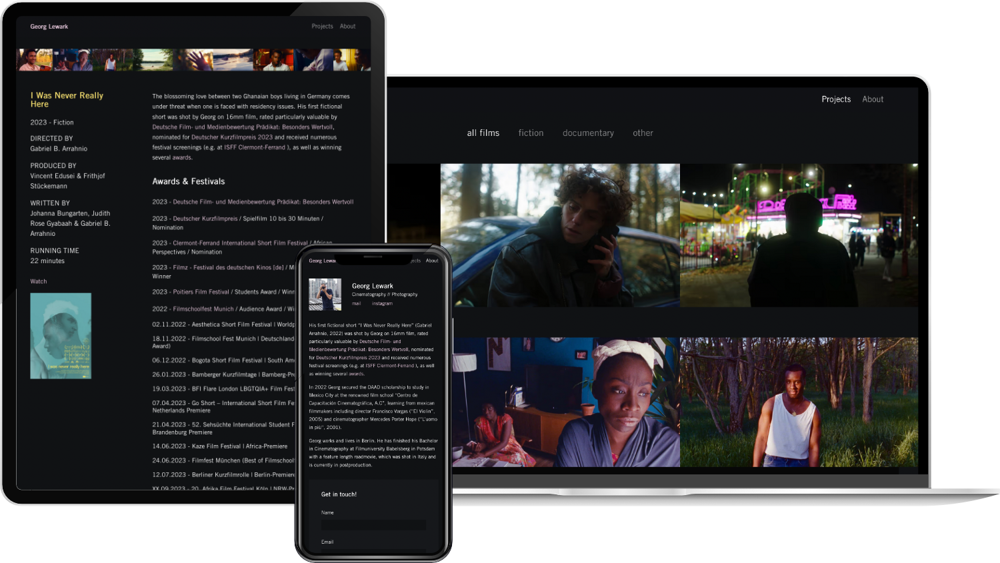

Nous avons conçu un portfolio minimaliste pour [Georg Lewark](https://georglewark.de/), cinéaste basé à Berlin. Le design s’efface pour laisser parler le travail : une grille de projets épurée mène à une page dédiée à chaque film, avec lecteurs Vimeo et YouTube intégrés, complétée par une page de présentation et un formulaire de contact simple.

Le site est une appli SvelteKit légère écrite en TypeScript. Les projets sont rédigés en Markdown, ce qui permet de mettre un nouveau film en ligne en quelques minutes, sans la lourdeur d’un CMS.
