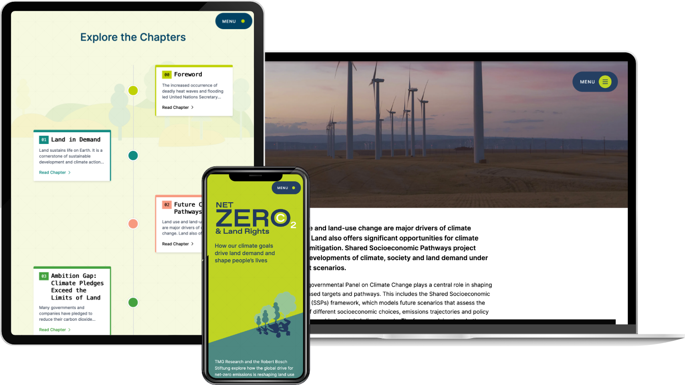

In collaboration with TMG Research and the Robert Bosch Stiftung, I designed and developed [Net Zero & Land Rights](https://netzerolandrights.com/), the companion website to their latest joint report. The report brings together insights from science, civil society, and voices from both Europe and the Global South, offering a critical analysis of how global climate strategies intersect with land rights, biodiversity, and social justice.

The website showcases each chapter in an engaging and visually cohesive way, enhanced by the stunning illustrations of STOCKMAR+WALTER. Every section is carefully designed to present figures and content in an aesthetically refined layout. A dedicated resources page allows users to download all figures and graphs in both PNG and SVG formats, alongside access to supplementary materials such as videos and publications. Additionally, the platform includes a media center where the organizations can publish commentaries and blog posts—ensuring the website remains a living, evolving resource in the years to come.

